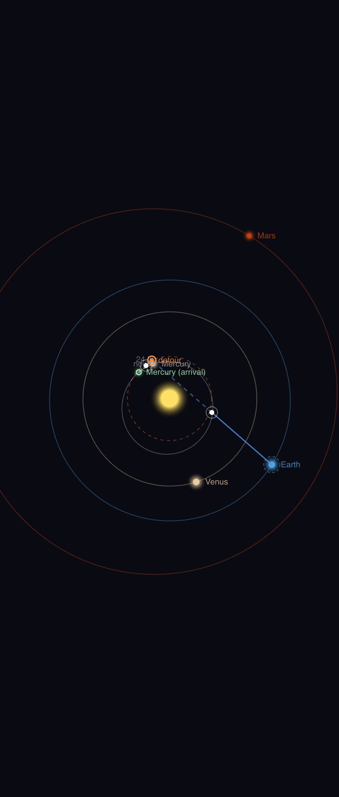
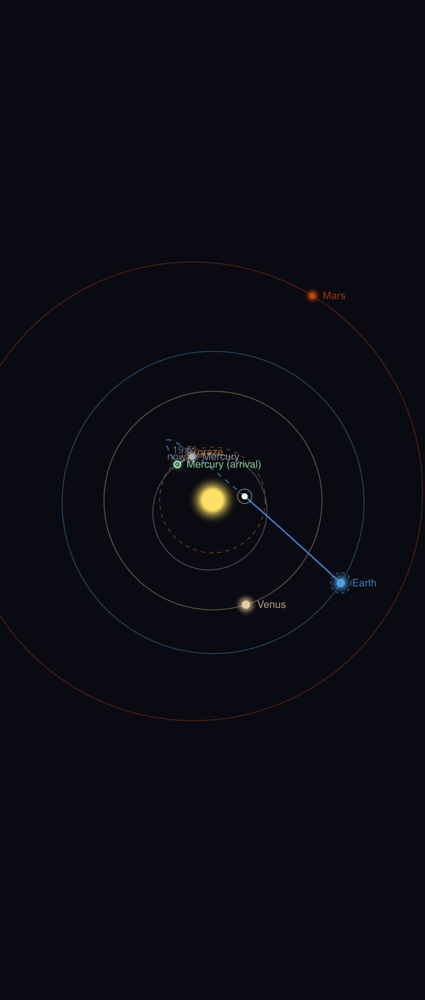
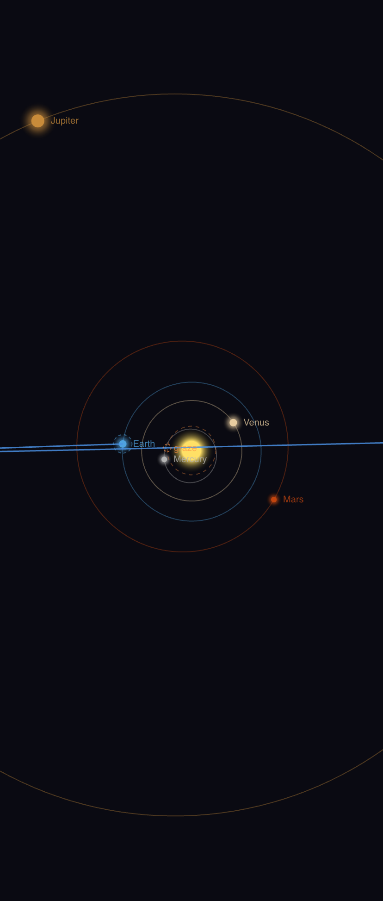

# SolPath

A constant-thrust spacecraft trajectory planner for the solar system. Choose a destination planet, set your acceleration, pick a departure date, and SolPath computes your brachistochrone flight path with accurate planetary positions and relativistic travel time corrections.

## Features

- Heliocentric solar system rendered on an interactive canvas
- Keplerian orbital mechanics — planetary positions accurate for any date
- Brachistochrone ("flip-and-burn") trajectory solver
- Relativistic ship-time correction at high delta-v
- Acceleration range: 0.01 g – 2 g, max speed capped at 10% c
- Solar exclusion zone with automatic detour routing
- Zoom, pan, and date scrubbing
- Spacecraft animation along computed path
- Comparison mode for multiple acceleration profiles

## Solar Exclusion Zone

Direct brachistochrone paths sometimes pass within 0.35 AU of the Sun — too close for thermal and radiation safety. When this happens, SolPath automatically reroutes the trajectory around the exclusion zone. An amber dashed ring marks the boundary, and a badge in the Mission Summary flags the detour.

You can choose how the ship handles the waypoint on the exclusion circle:

**Waypoint stop** — the ship decelerates to a full stop at the waypoint, then re-accelerates toward the destination. Two independent brachistochrone legs. Higher Δv; total time is proportional to √d₁ + √d₂.



**Smooth arc** — the ship never stops. One continuous brachistochrone covers the full path length d₁ + d₂, with the single flip point falling somewhere along the combined route. Always faster and lower Δv than the waypoint stop, since √(d₁ + d₂) < √d₁ + √d₂.



The detour is most extreme when the destination is nearly behind the Sun (solar conjunction). For Earth→Neptune this happens each year in early March, when the path passes within metres of the Sun's centre:



## Tech Stack

Plain HTML, CSS, and vanilla JavaScript (ES modules). No build step, no framework, no dependencies.

## Running Locally

```
git clone git@github.com:mturnbo/SolPath.git
cd SolPath
python3 -m http.server 8000   # or any static file server
```

Then open `http://localhost:8000` in a browser.

## Project Structure

```
SolPath/
├── index.html
├── README.md
└── src/
    ├── css/
    │   ├── reset.css
    │   └── main.css
    └── js/
        ├── main.js                      # Entry point, canvas bootstrap
        ├── data/
        │   └── planets.js               # Keplerian orbital elements (JPL)
        ├── physics/
        │   ├── kepler.js                # Orbital position solver
        │   ├── epoch.js                 # Julian date / J2000 utilities
        │   ├── trajectory.js            # Brachistochrone, relativity, detour solver
        │   └── mission.js               # Mission state builder
        ├── render/
        │   ├── camera.js                # World↔screen transform, zoom/pan
        │   ├── orbits.js                # Orbit ellipse renderer
        │   ├── planets.js               # Planet dot + label renderer
        │   ├── trajectory.js            # Path renderer (direct, stop, smooth arc)
        │   ├── spacecraft.js            # Ship position + glyph
        │   ├── arrivalOverlay.js        # Arrival flash effect
        │   ├── departurePlaceholders.js # Ghost markers at departure positions
        │   └── comparison.js            # Multi-acceleration overlay
        └── ui/
            ├── panel.js                 # Mission control panel
            ├── missionInfo.js           # Mission Summary section
            ├── relativity.js            # Time Dilation section
            ├── datepicker.js            # Departure date controls
            ├── controls.js              # Zoom / pan input handling
            ├── animator.js              # Spacecraft animation loop
            └── comparison.js            # Compare Accelerations panel
```

## Physics

**Brachistochrone trajectory** — the spacecraft accelerates at constant thrust for the first half of the journey, flips 180°, and decelerates for the second half. This minimises travel time for a given acceleration.

```
t_half = sqrt(2 × (d/2) / a)
total_time = 2 × t_half
```

At very high accelerations the ship would exceed 10% c before the halfway point. In that case a three-phase profile is used: accelerate to 0.1 c, cruise, decelerate.

**Relativistic ship time** — at high speeds the crew experiences less time than ground observers. At 10% c the correction is small (~0.5%) but included:

```
τ = (2c/a) × acosh(a × t_half / c + 1)
```

**Planetary positions** — computed from Keplerian orbital elements referenced to the J2000 epoch, with secular rates applied for each element. Accurate to within ~1° for visualization purposes across several centuries.

**Solar exclusion zone** — the closest approach of the line segment A→B to the Sun is:

```
t = −A·(B−A) / |B−A|²   (clamped to [0, 1])
closest = |A + t × (B−A)|
```

When `closest < 0.35 AU`, the direct path is rejected. A waypoint W on the 0.35 AU boundary is found via ternary search minimising √|AW| + √|WB| (time-optimal for the waypoint stop mode). Both semicircles of the boundary are searched; the global minimum is used.

## License

MIT
